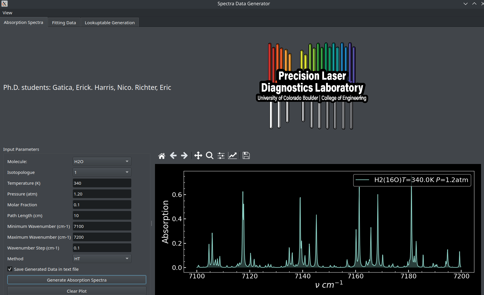

# **Spectra Data Toolkit (SWE4S Group 10)**

This is an assortment of software aimed towards making it easier to perform data analysis of absorption spectroscopy data, particularly when it comes to dual-comb spectroscopy. This repository seeks to achieve the following:
- Create a user-friendly GUI with which to interface with existing pldspectrapy fitting code
- Enable the creation of pre-computed lookup tables of spectral absorption data for inputted molecules at various inputted parameters
- Utilize these lookup tables to accelerate the fitting process of spectral absorption data


## **Table of Contents**
1. [Overview](#overview)
2. [Features and Usage](#features)
3. [Installation](#getting-started)
    - [Prerequisites](#prerequisites)
    - [Steps](#installation)
4. [Acknowledgments](#acknowledgments)

## **Features and Usage**

### **GUI**

- The GUI can be generated by running ```GUI_gen.py```. The GUI is split into three separate pages: Absorption Spectra, Fitting Data, and Lookup Table Generation. These pages can be navigated using the tabs at the top of the GUI.
- Within the Absorption Spectra page, parameters can be selected to produce the desired absorption spectra. Right now, molecule selection is limited to those listed, but this will be expanded in a future update. Spectra can be overlaid on top of each other by generating new spectra, and the plot can be cleared with the Clear Plot button. The data can be saved to a csv file using the Save Data button.
- The Fitting Data page can be used to fit spectral data to absorption curves in the HITRAN database. Paths for input data, results, and linelists must be provided, as well as the names of the input data file, results file name, and plot name. The input data must be of the .cor file type.
- The Lookup Table Generation page can be used to generate lookup tables of spectral absorption profiles for the inputted parameters.



### **Lookup Table Creation**
- Lookup table generation can be performed in a separate python script ```h6py_lookuptABLE_NICO_gen.py``` as well as through the GUI. Running this script will create a csv file containing the lookup table created from hardcoded parameters defined in the load_parameters function.


## **Installation**

### **Prerequisites**
- Python
- [Conda](https://docs.conda.io/projects/conda/en/stable/user-guide/install/index.html)
- Git
- (Optional) PyCharm (or another IDE of your choice)

### Steps

1. Clone the repository and enter the directory:

```bash
git clone https://github.com/ErickGatica/Software_Eng_Project.git
cd Software_Eng_Project
```

2. Create a conda environment from the `environment.yaml` file:

Clone the repo using git:

```bash
git clone https://github.com/ErickGatica/Software_Eng_Project.git
```


# Environment

To set the environment to work with this repo. In the folder where the repo was cloned:

```bash
conda env create -f environment.yaml
```

_Note if you want to name this environment somethign different, you can use the 
`--name` flag to overwrite the name in the environment file_

If you've already created the environment and just want to update it, you can use the following command:

```bash
conda env update -f environment.yaml
```

This will create a new conda environment named `spectra_software_env` and install the 
specified dependencies into it.

3. Activate the conda environment:

```bash
conda activate spectra_software_env
```

## **Acknowledgments**

The developers of this code with like to thank Eli Miller and Sean Coburn for helpful discussions.

Then, activate the environment:

```bash 
conda activate spectra_data_generator
```
